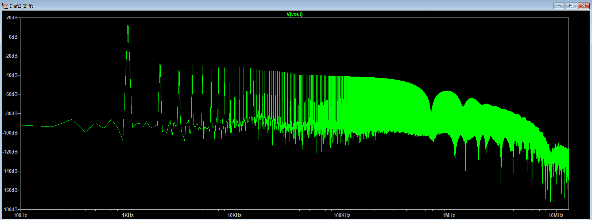
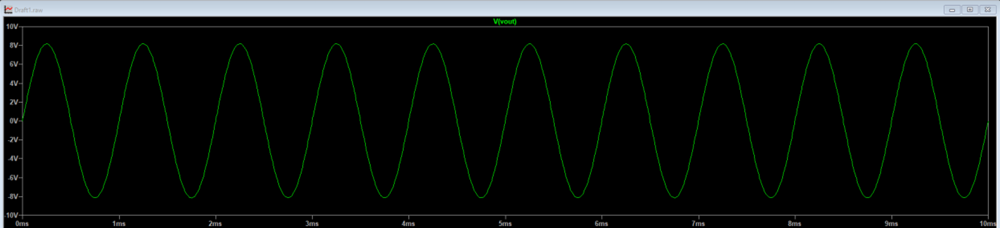

# High-Linearity Power Amplifier Design (Folded Cascode) ⚡

This project involves the design, simulation, and analysis of a **Multi-Stage Power Amplifier** capable of driving a 100Ω load with high linearity and wide voltage swing. 
The design evolves from a basic differential pair to a **Folded Cascode** topology to maximize the output swing and input common-mode range (ICMR).

## 🎯 Project Objectives
* Design a power amplifier with **Push-Pull Class AB** output stage.
* Minimize **Total Harmonic Distortion (THD)** to below 0.05%.
* Maximize Output Voltage Swing (Target: >16Vpp on ±10V supply).
* Optimize power efficiency and quiescent current.

## 🛠 Design Specifications & Tools
* **Simulation Tool:** LTspice XVII
* **Technology:** Discrete BJTs (2N3904, 2N3906) & NMOS.
* **Architecture:**
  * **Input Stage:** Folded Cascode (improved swing & bandwidth) [Reference: Sedra & Smith].
  * **Output Stage:** Class AB Push-Pull with feedback for crossover distortion elimination.
  * **Feedback:** Negative feedback implemented to stabilize gain (Av ≈ 2) and improve linearity.

## 📊 Key Results (Simulation)
Based on the final simulation results:

| Parameter | Value | Notes |
| :--- | :--- | :--- |
| **THD** | **0.05%** | Excellent linearity @ 1kHz [See FFT Plot below] |
| **Output Swing** | **~17.02 Vpp** | Near rail-to-rail operation |
| **Quiescent Power** | **28.5 mW** | Low static power consumption |
| **Bandwidth** | DC - 100kHz+ | Flat response in audio range |

## 📸 Simulation Plots

### 1. Final Schematic (Folded Cascode Topology)
The input stage was upgraded to a Folded Cascode structure to solve the voltage headroom limitations of the standard cascode.

### 2. Spectral Analysis (FFT)
Frequency domain analysis shows the dominance of the fundamental frequency (1kHz) and suppression of higher-order harmonics, resulting in THD < 0.05%.

### 3. Transient Response (Output Swing)
The amplifier drives the load with a clean sinusoidal wave without visible clipping or crossover distortion.

## 📄 Documentation
For detailed design calculations, DC operating point analysis, and theoretical justification, please refer to the full report:
[Download Project Report (PDF)](report.pdf)

---
*Designed as part of the Electronics II Course at Sharif University of Technology.*
